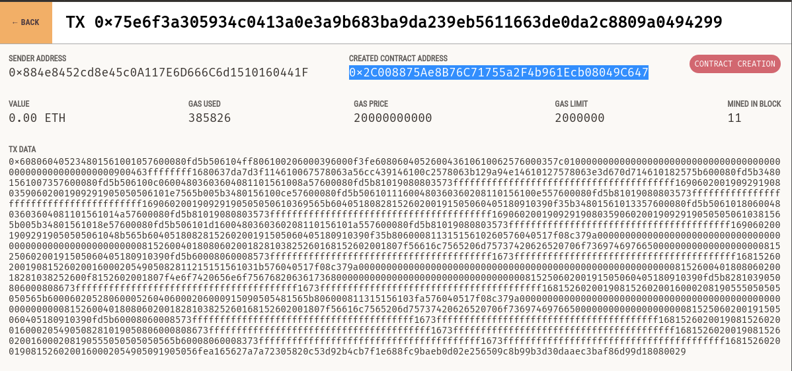
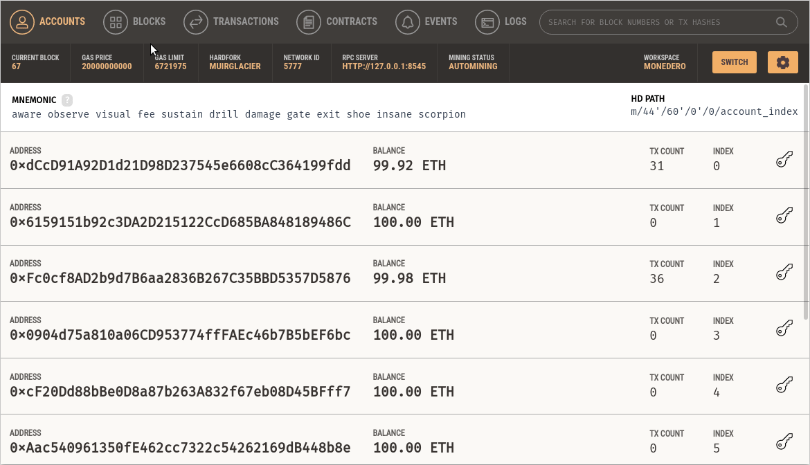
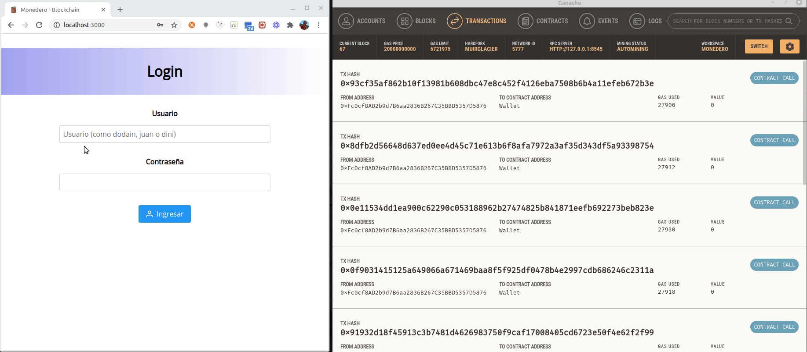
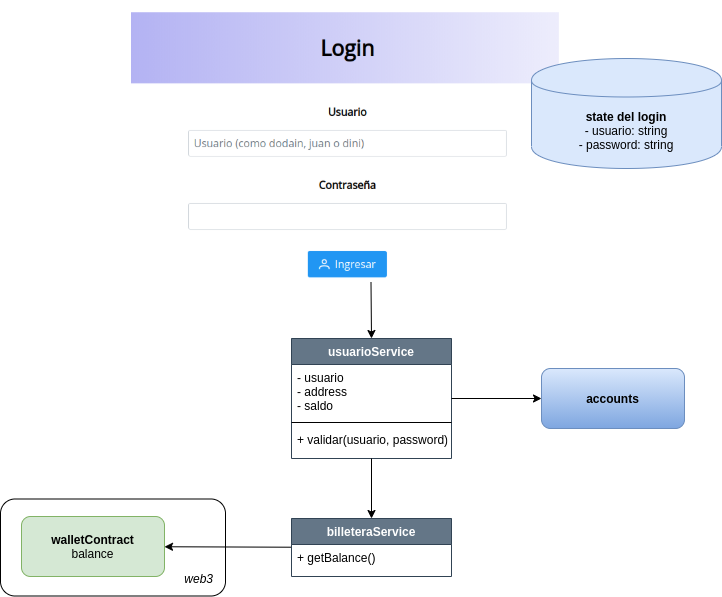
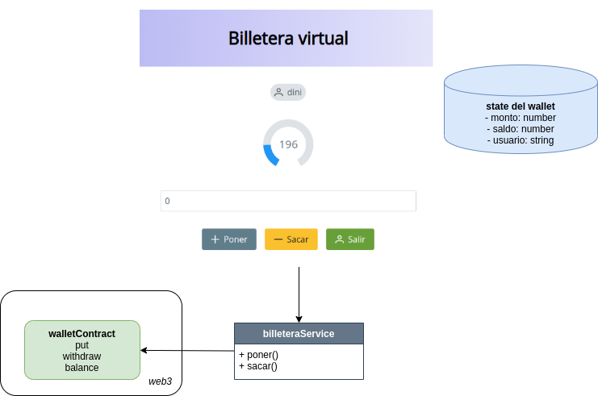
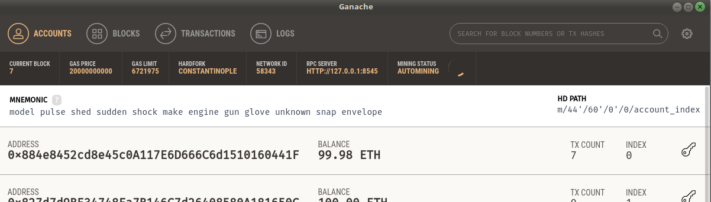

# Creando una aplicación React para interactuar con la billetera virtual

## Cómo conectar nuestro smart contract

En la consola Truffle escribimos

```js
JSON.stringify(Wallet.abi) // abi => Application Binary Interface
```

El output será importante en breve.

## Aplicación React

La creamos mediante CRA (create-react-app), con los siguientes componentes

* router de React
* [Primereact](https://www.primefaces.org/primereact/)
* y la biblioteca web3, que nos permite conectarnos al nodo Ethereum

Pueden ver el archivo `package.json` para más información.

## Conexión a la blockchain

Crearemos un servicio, donde tomaremos la configuración según el archivo `truffle-config.js`:

```js
import Web3 from 'web3'
import { cuentas } from './cuentas'

// hay que usar el puerto y host que tiene truffle-config.js
const web3 = new Web3(new Web3.providers.HttpProvider('http://localhost:8545'))

const walletABI = ...
    // copiar el output de la consola truffle cuando se ejecutó el comando
    // JSON.stringify(Wallet.abi)
    // ojo si crean funciones adicionales, deben volver a ejecutar el comando JSON.stringify(Wallet.abi)
    // y copiarlo nuevamente porque no estarán publicadas las funciones

// Address que sale de la solapa Contracts en Ganache, correspondiente al Smart Contract Wallet
// (con el que se deployó, como veremos a continuación)
const walletAddress = '0x17B045f1CB1BA5C01acc019BbFfFb4171CC1246E'
web3.eth.defaultAccount = web3.eth.accounts[0]

const walletContract = new web3
    .eth
    .Contract(walletABI, walletAddress)

// Address que sale de cualquiera de las cuentas de Ganache
const txAccount = '0xFc0cf8AD2b9d7B6aa2836B267C35BBD5357D5876'
```

Para obtener la address correspondiente al Smart Contract Wallet, podemos

1. buscar la transacción asociada a la creación de dicho smart contract



2. o, mucho más fácil, asociar nuestro proyecto Truffle y ver en la solapa Contracts cuáles son las addresses asociadas al Wallet



## Levantar la app

- levantar Ganache en un puerto, supongamos 8545
- si esa instancia no tiene nuestro Smart Contract, debemos compilar e instalarlo en dicha red mediante los comandos

```bash
truffle compile
truffle migrate --reset
```

- iniciar la aplicación React con `yarn start`

## Demo de la app



### Cómo funciona el login



Internamente el login maneja como estado usuario y password, y se valida delegando al singleton usuarioService

- el nombre de la persona se asocia a un mapa de direcciones (addresses), por el momento está hardcodeado en un archivo local de la aplicación (esto podría externalizarse a cualquier medio persistente que ya hemos visto)
- luego hacemos la consulta por _address_ a la billetera mediante una llamada al objeto _walletContract_ generado por web3 que como resultado nos devolverá el _balance_ (saldo) de la cuenta
- el usuarioService como singleton de la aplicación nos sirve para almacenar los datos de la persona logueada: nombre, address de la blockchain y saldo actual

Por motivos didácticos simplificamos el login, donde ni siquiera hay validación de contraseña.

### Formulario que muestra la billetera



En el formulario de la billetera, recibimos la información del nombre y saldo de la cuenta, al que le agregamos como estado el monto a poner o sacar. Ambas operaciones se delegan en el usuarioService, que

- delega la acción put/withdraw al _walletContract_ de web3. Es decir, que el código de negocio está - escrito en el Smart Contract, en el lenguaje Solidity. 
- Esta es una decisión de diseño, para no repetir la misma operación en React: en ningún momento se suma o resta al saldo de la cuenta. Esto permite por ejemplo no duplicar las validaciones
- Otro aspecto importante es que todas las llamadas a web3 **son asincrónicas**
- La forma entonces de recuperar el saldo actual, es haciendo otra llamada para obtener el saldo, al igual - que hicimos en el login
- El nuevo saldo se refresca en el componente mediante la acción que setea el nuevo estado
- Por último, inicializamos el state del formulario, blanqueando el monto a ingresar

## Llamadas a web3: call vs. transaction

Antes que nada, podríamos haber definido un backend para trabajar las llamadas a web3, pero preferimos mantener la arquitectura lo más simple posible. 

### Call

Veamos cómo se resuelve la llamada para obtener el balance:

```js
const balance = await walletContract.methods.balance(account.address).call()
```

En general [hay varias formas de resolver la llamada](https://web3js.readthedocs.io/en/1.0/web3-eth-contract.html#id12), pero la que mejor resultado nos dio fue seguir la sintaxis:

```js
objetoSmartContract.methods.metodoAEjecutar(parametros).call()
```

donde call() debe invocarse sin parámetros, que van seguidos al método a ejecutar. Recordemos que el objeto walletContract se obtiene en el archivo setup:

```js
const walletContract = new web3
    .eth
    .Contract(walletABI, walletAddress)
```

Esta es una operación que no produce un nuevo bloque en la blockchain, es simplemente una consulta, por eso se define en el Smart Contract como un método `view`:

```solidity
    function balance(address owner) public view returns(int256) {
        return wallet[owner];
    }
```

### Transaction

Por otra parte, poner plata en la billetera es una operación que requiere una cuenta que pague la operación. Por lo tanto, no podemos utilizar el mensaje `call()`, sino `send()`:

```js
await walletContract.methods.put(account.address, amount).send({ from: txAccount })
```

Para invocar al mensaje `send` (anteriormente `sendTransaction`), es necesario pasar una dirección que tenga suficiente gas para realizar la operación. Eso se consigue mediante estos pasos:

1) Desde Ganache, solapa Accounts, buscamos alguna de las direcciones que viene cuando levanta la aplicación:



Por ejemplo, podemos elegir la primera. Copiamos ese address.

2) Lo pegamos en la variable `txAccount` del archivo `setup.js`

```js
export const txAccount = '0x884e8452cd8e45c0A117E6D666C6d1510160441F'
```

## Otros tutoriales

* [Ratings de peliculas](https://medium.com/@takleakshar/how-to-build-a-decentralized-full-stack-app-in-ethereum-and-react-42e63d45a208)
* [Aplicaciones React descentralizadas](http://reactdapps.com/)
