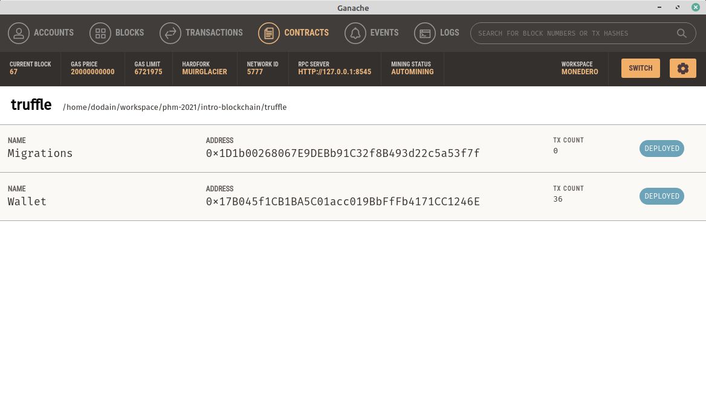
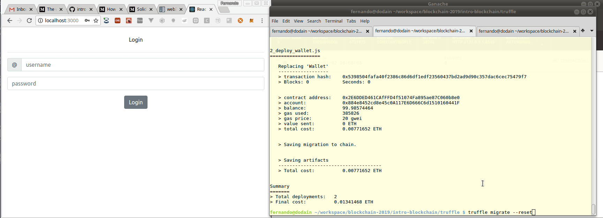
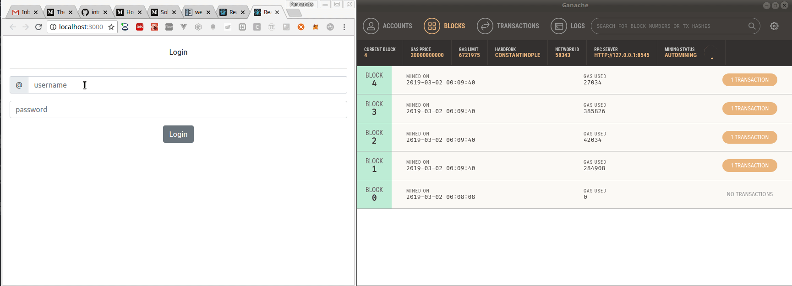
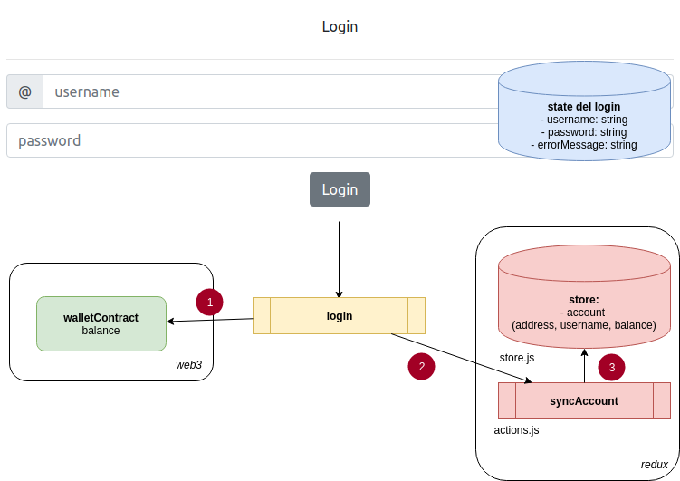

# Creando una aplicación React para interactuar con la billetera virtual

## Cómo conectar nuestro smart contract

En la consola Truffle escribimos

```js
JSON.stringify(Wallet.abi) // abi => Application Binary Interface
```

El output será importante en breve.

## Aplicación React

La creamos mediante CRA (create-react-app), con los siguientes componentes

* router de React
* [Primereact](https://www.primefaces.org/primereact/)
* y la biblioteca web3, que nos permite conectarnos al nodo Ethereum

Pueden ver el archivo `package.json` para más información.

## Conexión a la blockchain

Crearemos un servicio, donde tomaremos la configuración según el archivo `truffle-config.js`:

```js
import Web3 from 'web3'
import { cuentas } from './cuentas'

// hay que usar el puerto y host que tiene truffle-config.js
const web3 = new Web3(new Web3.providers.HttpProvider('http://localhost:8545'))

const walletABI = ...
    // copiar el output de la consola truffle cuando se ejecutó el comando
    // JSON.stringify(Wallet.abi)
    // ojo si crean funciones adicionales, deben volver a ejecutar el comando JSON.stringify(Wallet.abi)
    // y copiarlo nuevamente porque no estarán publicadas las funciones

// Address que sale de la solapa Contracts en Ganache, correspondiente al Smart Contract Wallet
// (con el que se deployó, como veremos a continuación)
const walletAddress = '0x17B045f1CB1BA5C01acc019BbFfFb4171CC1246E'
web3.eth.defaultAccount = web3.eth.accounts[0]

const walletContract = new web3
    .eth
    .Contract(walletABI, walletAddress)

// Address que sale de cualquiera de las cuentas de Ganache
const txAccount = '0xFc0cf8AD2b9d7B6aa2836B267C35BBD5357D5876'
```

Para obtener la address correspondiente al Smart Contract Wallet, podemos

1. buscar la transacción asociada a la creación de dicho smart contract


2. o, mucho más fácil, asociar nuestro proyecto Truffle y ver en la solapa Contracts cuáles son las addresses asociadas al Wallet



TODO: Explicar cómo se asocia el proyecto Truffle.

## Repaso de tareas previas a levantar la app

Cuando levantemos una instancia de Ganache, en nuestro caso en el puerto 8545, tenemos que hacer algunas cosas.

* como en este caso agregamos una función para recuperar el saldo de una _address_, debemos primero compilar el smart contract con `truffle compile` y recuperar el nuevo `abi` (o de lo contrario el componente web3 no encontrará las funciones nuevas que acabamos de crear)
* deployar los smart contracts en la EVM con `truffle migrate --reset`
* modificar en el archivo `setup.js` la variable `walletAddress` con el address del Smart Contract, para sincronizar nuestro `Wallet.sol` con la aplicación React
* reiniciar la aplicación con `npm start`



## Demo de la app



### Cómo funciona el login



Internamente el login maneja como estado usuario y password (tiene un binding bidireccional de ambos campos), además de mostrar mensajes de error con un componente custom. Al hacer click sobre el botón "Login" se dispara un método interno que

* busca la cuenta asociada al username ingresado por el usuario
* con el objeto cuenta encontrado, hace la consulta por _address_ a la billetera mediante una llamada al objeto _walletContract_ generado por web3 que como resultado nos devolverá el _balance_ (saldo) de la cuenta
* esto dispara la acción **sync_account** que le asigna la cuenta (con el saldo actual) al _store_ de Redux
* por último utilizamos el router de React para llevarnos a `/wallet`

Por motivos didácticos simplificamos el login, donde ni siquiera hay validación de contraseña.

### Formulario que muestra la billetera


En el formulario de la billetera, tanto el nombre de usuario como el saldo salen del store de Redux. Además, tenemos como estado interno _amount_ (el monto a poner o sacar de la billetera) y un _errorMessage_ para las operaciones.

En el caso de poner (put) o sacar (withdraw) plata, se dispara un método interno que

* delega la acción put/withdraw al _walletContract_ de web3. Es decir, que el código de negocio está escrito en el Smart Contract, en el lenguaje Solidity. 
* Esta es una decisión de diseño, para no repetir la misma operación en React: en ningún momento se suma o resta al saldo de la cuenta. Esto permite por ejemplo no duplicar las validaciones
* Otro aspecto importante es que todas las llamadas a web3 **son asincrónicas**, por lo tanto, no pueden ser invocadas en las acciones de Redux que necesita mantener el sincronismo
* La forma entonces de recuperar el saldo actual, es haciendo otra llamada para obtener el saldo, al igual que hicimos en el login
* Una vez obtenido el saldo, disparamos la acción **syncAccount** de Redux, que produce el efecto en el store y provoca un render del label que muestra el saldo de la cuenta
* Por último, inicializamos el state del formulario, blanqueando el monto a ingresar y el mensaje de error, lo que produce un render de dichos campos del formulario

## Llamadas a web3: call vs. transaction

Antes que nada, podríamos haber definido un backend para trabajar las llamadas a web3, pero preferimos mantener la arquitectura lo más simple posible. 

### Call

Veamos cómo se resuelve la llamada para obtener el balance:

```js
const balance = await walletContract.methods.balance(account.address).call()
```

En general [hay varias formas de resolver la llamada](https://web3js.readthedocs.io/en/1.0/web3-eth-contract.html#id12), pero la que mejor resultado nos dio fue seguir la sintaxis:

```js
objetoSmartContract.methods.metodoAEjecutar(parametros).call()
```

donde call() debe invocarse sin parámetros, que van seguidos al método a ejecutar. Recordemos que el objeto walletContract se obtiene en el archivo setup:

```js
const walletContract = new web3
    .eth
    .Contract(walletABI, walletAddress)
```

Esta es una operación que no produce un nuevo bloque en la blockchain, es simplemente una consulta, por eso se define en el Smart Contract como un método `view`:

```js
    function balance(address owner) public view returns(int256) {
        return wallet[owner];
    }
```

### Transaction

Por otra parte, poner plata en la billetera es una operación que requiere una cuenta que pague la operación. Por lo tanto, no podemos utilizar el mensaje `call()`, sino `send()`:

```js
await walletContract.methods.put(account.address, amount).send({ from: txAccount })
```

Para invocar al mensaje `send` (anteriormente `sendTransaction`), es necesario pasar una dirección que tenga suficiente gas para realizar la operación. Eso se consigue mediante estos pasos:

1) Desde Ganache, solapa Accounts, buscamos alguna de las direcciones que viene cuando levanta la aplicación:


Por ejemplo, podemos elegir la primera. Copiamos ese address.

2) Lo pegamos en la variable `txAccount` del archivo `setup.js`

```js
export const txAccount = '0x884e8452cd8e45c0A117E6D666C6d1510160441F'
```

## TODO: Lista de pendientes

* Hacer testeo unitario y testeo de los formularios con Jest

## Otros tutoriales

* [Ratings de peliculas](https://medium.com/@takleakshar/how-to-build-a-decentralized-full-stack-app-in-ethereum-and-react-42e63d45a208)
* [Aplicaciones React descentralizadas](http://reactdapps.com/)
