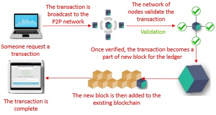

# Ethereum

[Ethereum](https://www.ethereum.org/) es una plataforma open-source que soporta  _smart contracts_ entre pares siguiendo el modelo de Blockchain.

A continuación vamos a contar las principales características de este proyecto.

## Descentralización en nodos de igual jerarquía

Los objetivos de Ethereum son descentralizar la web, eliminando intermediarios y organismos reguladores. Por lo tanto la arquitectura tiene un esquema _peer-to-peer_, donde cada nodo tiene la misma importancia que los demás en una red Ethereum (en lugar de tener un servidor como fuente central de información).

## Ethereum Virtual Machine (EVM)

Cada nodo tiene instalado un ambiente donde se procesan los smart contracts: la Ethereum Virtual Machine (EVM), que trabaja a nivel bytecodes. Esto implica que un Smart Contract puede estar escrito en [Solidity](https://solidity.readthedocs.io/en/v0.5.3/), [Serpent](https://github.com/ethereum/wiki/wiki/Serpent), [Viper](https://vyper.readthedocs.io/en/latest/), [Lisk](https://lisk.io/) o Chain, cualquiera de estos lenguajes se compila a un bytecode que la máquina virtual de Ethereum puede interpretar.

## Ether

El _ether_ es una criptomoneda (también llamado cripto-combustible) que sirve para el intercambio de mensajes dentro de la red Ethereum. Cada vez que queremos procesar un smart contract en la EVM, esto implica un costo computacional que debe pagar el cliente (el que origina ese mensaje), evaluado en una cierta cantidad de _ether_.

El valor del _ether_ varía como cualquier otra moneda, podemos ver [el valor actual en varios sitios web](https://coinmarketcap.com/es/currencies/ethereum/).

### Medidas de ether

Existen denominaciones para diferentes valores, que podemos ver en la siguiente tabla

| Denominación | Valor |
| ------- | ----- |
| wei | 1 |
| szabo | 10^12 |
| finney | 10^15 |
| ether | 10^18 |
| kether, einstein | 10^21 | 

Para más información recomendamos ver [esta tabla](https://etherconverter.online/)

## Tipos de mensaje

Una vez que accedemos a una red privada de Ethereum, podemos enviar un mensaje, lo que implica procesar un smart contract con valores concretos. Los tipos de mensaje que existen son:

- pasar ether 

## Circuito de flujo de un mensaje => Proof of Work

Los smart contracts se agrupan en transacciones que forman un bloque, y entonces se crea un bloque que se agregará al resto de los bloques que conforman la cadena con la información (por eso el término **blockchain**).

Cada transacción es validada por un proceso llamado **minero**. Este mecanismo de validación

* establece un mecanismo de confianza (consenso) entre todos los nodos
* evita fraudes o información maliciosa, ya que solamente un bloque **verificado** se puede agregar a la cadena de bloques reconocida

### En qué consiste la validación: **Proof of Work**

El **proof of work** consiste en resolver un algoritmo matemático no trivial. Varios nodos compiten y el primero que lo resuelve es recompensado con un porcentaje de _ether_ de comisión. El algoritmo es asimétrico y solo puede resolverse por fuerza bruta, de esa manera el _ether_ funciona como incentivo para que la red sea segura y no necesite intermediarios.

## Más información

* [este artículo cuenta la forma básica de trabajo de la Ethereum Virtual Machine](https://cryptodigestnews.com/blockchain-basics-what-is-evm-52d83616764)
* [este artículo profundiza sobre la diferencia entre la Proof of Work vs. Proof of Stake](https://blockgeeks.com/guides/proof-of-work-vs-proof-of-stake/)