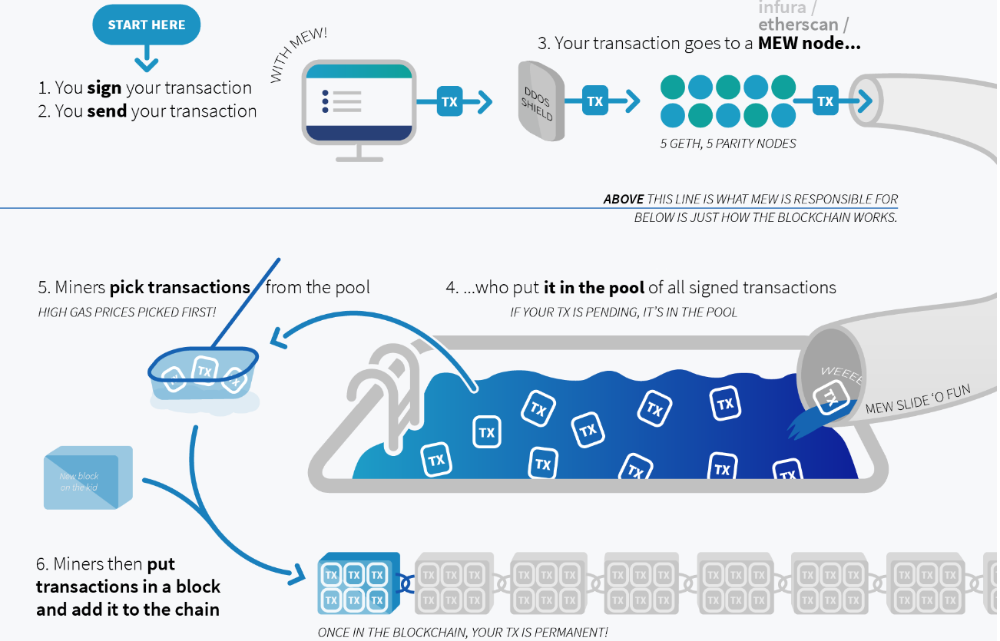
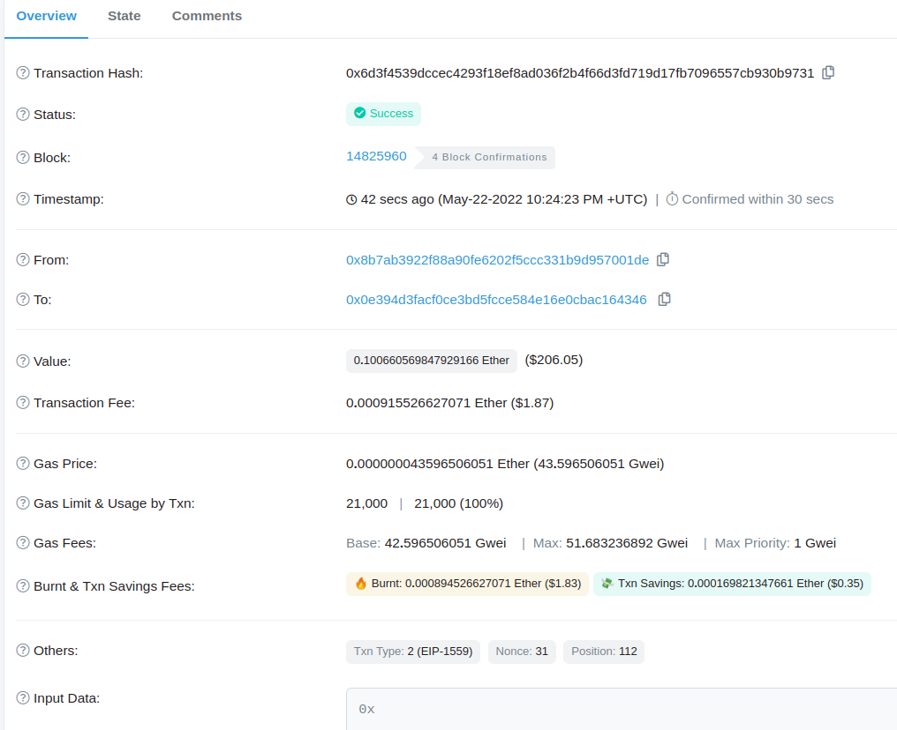
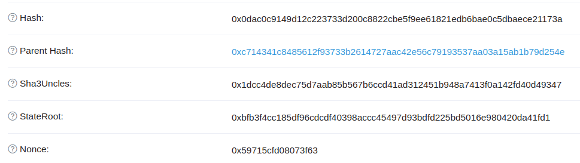
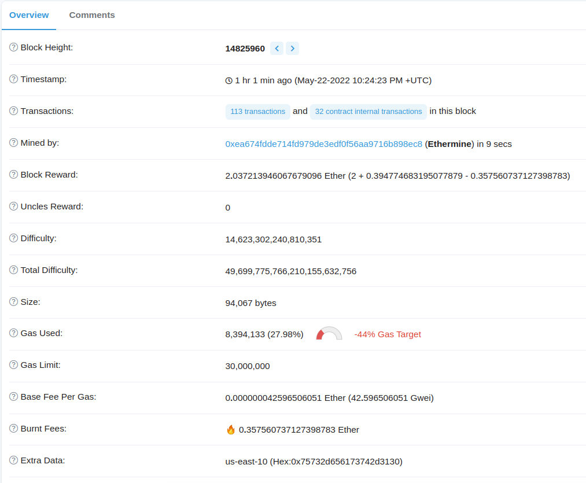
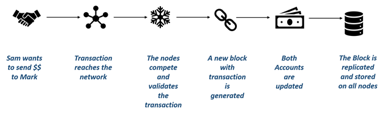
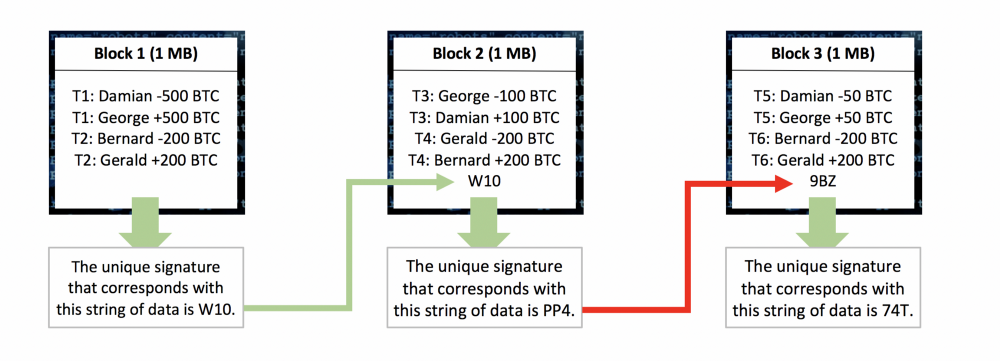
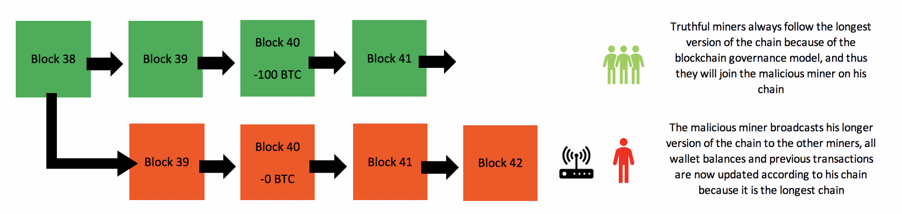

# Ethereum

[Ethereum](https://www.ethereum.org/) es una plataforma open-source que soporta  _smart contracts_ entre pares siguiendo el modelo de Blockchain.

A continuación vamos a contar los principales conceptos de esta arquitectura:

* Objetivo Principal
  * Smart Contract
  * Transacción
* Nodos
  * Nodos mineros
  * Ethereum Virtual Machine
  * Otros tipos de nodos
* Ether
  * Medidas
* Cuentas
* Transacciones
  * Gas, gas price y start gas (gas limit)
  * Start gas mayor al requerido
  * Start gas menor al requerido
  * Sobre el start gas
* Circuito de una Transacción en la Blockchain
  * Proof of Work
* Ataques a la seguridad
  * Denial of Service
  * 51% Attack
* Proof of Stake

____

## Objetivo principal de la blockchain

Los objetivos de Ethereum son descentralizar la web, eliminando intermediarios y organismos reguladores. Por lo tanto la arquitectura tiene un esquema _peer-to-peer_, donde cada nodo tiene la misma importancia que los demás en una red Ethereum (en lugar de tener un servidor como fuente central de información).

Un smart contract define una relación contractual entre pares, que se instancia con datos a partir de una **transacción**. Algunos ejemplos posibles son: el voto por un candidato en una elección, el valor de venta de una propiedad, el currículum de una persona, el sueldo promedio de un oficio determinado, una billetera electrónica, etc.

## Nodos

### Nodos mineros

La mayoría de los nodos, llamados **mineros**, tienen una gran capacidad de procesamiento y cumplen las siguientes funciones:

* reciben transacciones nuevas que llegan y verifican su validez
* las agregan a la _blockchain_
* y notifican a los demás nodos mineros (evitando duplicar información)

Más adelante describiremos con más profundidad el proceso, por el momento es importante saber que cada nodo contiene exactamente la misma información que los demás. Esta redundancia permite asegurar que aunque se caigan los nodos, la _blockchain_ es tolerante a fallos.

Para poder procesar las transacciones, cuentan con una Virtual Machine propia de Ethereum, como veremos a continuación.

### EVM: Ethereum Virtual Machine

El ambiente donde se procesan las operaciones primitivas de los smart contracts es la Ethereum Virtual Machine (EVM), que trabaja a nivel bytecode. Un Smart Contract puede estar escrito en diferentes lenguajes: [Solidity](https://solidity.readthedocs.io/en/v0.5.3/), [Viper](https://vyper.readthedocs.io/en/latest/) o [Lisk](https://lisk.io/), cualquiera de estos lenguajes se compila a un bytecode que la máquina virtual de Ethereum puede interpretar. Pueden investigar más en la [wiki de Ethereum](https://eth.wiki/).

Algo interesante de remarcar es que la EVM está pensada para trabajar 

* **en forma determinística**: dado un estado inicial y una función siempre obtendremos el mismo estado final
* **aislada**: por eso cada nodo procesa los smart contracts en forma independiente
* **terminable**: como veremos más adelante con el valor **start gas** el propio algoritmo de la EVM se asegura de que dentro de un límite de tiempo se resolverá el estado final.

### Otros tipos de nodos

Algunos nodos llamados _non-miners_ tienen menor capacidad de procesamiento y solo proveen la EVM para hacer operaciones pero no pueden validar que la transacción sea correcta, dependen del nodo minero para esta tarea.

Recientemente se separó la idea de **full node** para nodos que contienen todo el historial de transacciones de blockchain y por lo tanto son totalmente confiables, versus los **light node** que solo contienen el último estado activo de la blockchain. El objetivo que persigue es la escalabilidad de la blockchain conforme crecen exponencialmente las operaciones.

### Para el curioso...

En https://etherscan.io/nodetracker pueden ver todos los nodos alrededor del mundo (en Argentina hay 2 aunque eso puede ir variando...)

## Ether

El _ether_ es una criptomoneda (también llamado cripto-combustible) que sirve para el intercambio de mensajes dentro de la red Ethereum. Cada vez que queremos procesar una transacción en la EVM, esto implica un costo computacional que debe pagar el cliente (el que origina la transacción), evaluado en una cierta cantidad de _ether_.

Al igual que cualquier otra moneda, el _ether_ tiene una cotización que puede consultarse en varios sitios web, por ejemplo [aquí](https://coinmarketcap.com/es/currencies/ethereum/).

### Medidas de ether

Existen denominaciones para diferentes valores, que podemos ver en la siguiente tabla

| Denominación | Valor |
| ------- | ----- |
| wei | 1 |
| szabo | 10^12 |
| finney | 10^15 |
| ether | 10^18 |
| kether, einstein | 10^21 | 

Para más información recomendamos ver [esta tabla](https://etherconverter.online/)

## Cuentas

Por el momento existen [dos tipos de cuentas de Ethereum](https://ethereum.org/en/developers/docs/accounts/):

* **cuentas externas** (EOA: Externally Owned Accounts), que pertenecen a personas físicas, se identifican por la clave privada de dicha cuenta (técnicamente por los primeros 160 caracteres).
* **cuentas de contrato** (Contract Accounts), las que pertenecen a un Smart Contract, no tienen clave privada sino una dirección pública o _address_ y almacenan código.

Está la idea de unificar las cuentas para que incluso las cuentas de personas estén regidas por código para accederlo. En los próximos años seguramente tendremos novedades.

## Transacciones

Las transacciones son funciones que toman un estado inicial (S) y producen un cambio final (S') que modifica la blockchain. Algunas de esas funciones incluyen

* transferir ether de una cuenta a otra (cualesquiera sean)
* el _deploy_ de un Smart Contract por parte de una cuenta externa (así es como se crean)
* ejecutar una llamada a otra función de un smart contract

Cuando repasemos el circuito de una transacción veremos su estructura.

### Gas, gas price y gas limit (start gas)

El valor del ether no es fijo, sino que fluctúa en base a lo que cada persona está dispuesta a pagar para que se procese su Smart Contract. Por eso existe el concepto de **gas**, que permite medir el costo computacional de cada operación que pedimos ejecutar. Consideremos el siguiente ejemplo:

- asignamos el valor 25 en una variable => 45 gas
- sumamos uno a la variable del paso anterior => 10 gas
- guardamos el resultado en una nueva variable => 45 gas

El total de gas necesario para ejecutar la transacción es 100 gas. Para procesar el smart contract hay algunos valores que son importantes:

- **gas price**: el valor que estamos dispuestos a pagar por unidad de gas para que un minero procese y firme la transacción. Mientras más paguemos, más rápidamente será procesada la transacción, ya que los mineros eligen primero las transacciones que más pagan.
- **gas limit/start gas**: indica la cantidad máxima de gas que vamos a pagar por una operación. Si nos encontramos haciendo un loop en donde nos olvidamos de incrementar el índice, en algún momento excederemos el máximo permitido y la EVM hará un rollback de la transacción cobrando únicamente el gas máximo establecido como límite. Por lo tanto un smart contract que tiene vulnerabilidades solo nos costará un valor acotado en ether.

### Caso 1: Start Gas < al requerido para ejecutar la transacción

Si queremos procesar la transacción de nuestro ejemplo y enviamos:

- gas limit: 125
- gas price: 2 Gwei (1 Gigawei son 1^9 wei)
- y la transacción que requiere 100 gas

Hasta agosto del 2021, cuando se procesaba la transacción exitosamente...

- se agregaba a la blockchain de Ethereum
- el minero recibía el gas requerido * gas price = 100 * 2Gwei = 200 Gwei como recompensa por sus servicios
- a la persona que envió la transacción se le quitaban 200 Gwei por el servicio de procesamiento (125 - 100 = 25 de gas quedaban para utilizar en la próxima transacción a un precio que fijara).

### London fork - EIP 1559

El [precio del Gas de Ethereum parecía haberse disparado](https://www.statista.com/statistics/1221821/gas-price-ethereum/). Para ayudar a hacerlo más estable, se implementó un fork en donde cada transacción define a partir de ahora:

- un **base fee**, que es el valor base determinado por la oferta/demanda de mineros.
- un **tip fee**: es la propina que vamos a darle al minero.

Para el mismo ejemplo anterior, si enviamos

- start gas/gas limit: 125
- gas price: 2 Gwei
- base fee: 1,5 Gwei
- tip fee: 0,5 Gwei
- transacción requiere: 100 gas

Cuando se procese exitosamente la transacción:

- se agregará a la blockchain de Ethereum
- se cobrará (100 gas x 2 Gwei) = 200 Gwei a la persona que originó la transacción...
- ... (100 gas x 1,5 Gwei) = 150 Gwei **se queman** (es decir, desaparecen)
- ... (100 gas x 0,5 Gwei) = 50 Gwei se transfieren al minero como recompensa por sus servicios.

### Caso 2: Start Gas > al requerido para ejecutar la transacción

Si queremos procesar la transacción de nuestro ejemplo y enviamos:

- start gas/gas limit: 80
- gas price: 2 Gwei (1 Gigawei son 1^9 wei)
- base fee: 1,5 Gwei
- tip fee: 0,5 Gwei
- y la transacción que requiere 100 gas

una vez que haya sido procesado, los efectos serán:

- la transacción no se puede completar, sin embargo se agregará a la blockchain de Ethereum y se marcará como "no procesada"
- el minero recibirá como recompensa = (80 * 0,5Gwei = 40 Gwei)
- y se **queman** los (80 x 1,5Gwei) = 120 Gwei

### Sobre el valor del start gas

Como hemos visto, asignar un valor de start gas muy bajo nos hace gastar ese combustible sin poder procesar nuestra transacción. Pero por otra parte, tampoco es conveniente fijar un start gas muy grande:

- si tenemos un smart contract que entra en _loop infinito_, mayor será el costo que paguemos
- además, las transacciones se agrupan en un **bloque** que a su vez tiene un **gas limit**. Esto significa que si tenemos 3 transacciones: A con start gas 300, B con start gas 400 y C de 500, y el bloque tiene un gas limit de 1100, solo podremos procesar las transacciones A y B en ese bloque. Si bajamos el start gas de la transacción C de 500 a 400, el minero puede incluirla dentro del bloque y procesarla.

Para más información pueden ver este [artículo que cuenta en profundidad la diferencia entre gas y ether con ejemplos prácticos](https://blockgeeks.com/guides/ethereum-gas-step-by-step-guide/) y [esta consulta](https://ethereum.stackexchange.com/questions/30944/start-gas-vs-gas-limit).

## Diagrama de flujo de una transacción



### Estructura de una transacción

Todo comienza cuando se genera una transacción, que contiene la siguiente estructura

* **from/quién la origina**
* **to/a quién se dirige:** en el caso de la transferencia es la cuenta de destino, en el caso de la creación de un smart contract este campo está vacío
* **value:** la cantidad de ether a transferir, en el caso de una transferencia
* **input:** apunta al bytecode a ejecutar dentro de la EVM para controlar la transacción
* **blockhash** y **blocknumber**, inicialmente vacíos, cuando una transacción luego se agrupa contiene el identificador o hash del bloque y qué orden ocupa (blocknumber).
* **gas price**, **gas price**, **gas fees**, explicados anteriormente.

entre otros datos.

Si querés investigar, podés ingresar a la dirección https://etherscan.io/txs, y buscar por ejemplo la última transacción haciendo click sobre ella:



### Agrupando la transacción en un bloque

Cuando una transacción se crea, es recibida por todos los nodos mineros de la red, que las agrupan hasta formar un bloque. Cada bloque contiene

* un **hash**, acompañado de los campos **difficulty** y **nonce** que explicaremos a continuación



* **gas used**, que se refiere a la cantidad de combustible utilizado para procesar las transacciones que están en el bloque
* **gas limit**, el máximo de combustible permitido: esto evita que en un mismo bloque haya muchas transacciones que sean computacionalmente costosas, ya que pasarán a formar parte del próximo bloque. Por ejemplo, si el gas limit es 1.000, y el gas used es 800, si tenemos una transacción de 250 no formará parte de ese bloque.
* **mined by**, el nodo que a la larga será el ganador del proceso de minado
* **block height**, el número correlativo que ocupa el bloque en la _blockchain_
* **parent hash**, o puntero al bloque anterior
* **transactions**, apuntando al conjunto de transacciones que conforman el bloque. Por una cuestión de optimización, se trabaja con un árbol binario o **Merkle tree** que permite rápidamente validar el conjunto de transacciones dentro del bloque. Para profundizar más pueden ver [este video](https://www.youtube.com/watch?v=fB41w3JcR7U)
* **timestamp**, con el momento de creación del bloque

Podés navegar por la página etherscan hasta llegar a un bloque, como el https://etherscan.io/block/7221830:



### Proof of work para un bloque

Todos los mineros compiten para ver quién puede crear un bloque válido lo más rápido posible, lo que consiste en resolver un desafío que es el **algoritmo de consenso**. Para explicar cómo funciona dicho algoritmo, imaginemos que tenemos un campo alfanumérico, por ejemplo "Joni -> Dodain 4 ether", lo que produce el siguiente hash

```
5a04f4d588d8c8c82a4a5a0eeb9eb80af1d4f115395fb21d44f3dcb253977b5a
```

si le agregamos el valor "K", esto produce que el dato sea "Joni -> Dodain 4 etherK" y el hash cambie a

```
00823dec910b4b60ee5d176bab6cc0f40e301b4d54727537de4973ab864b8e64
```

Lo que hace cada minero es generar un hash del bloque combinando de a pares los hashes de todas las transacciones que lo conforman + un valor aleatorio de dígitos alfanuméricos y ver qué hash sale. El desafío se resuelve cuando encontramos un hash válido, es decir, cuando el hash **comienza con una serie de una determinada cantidad de ceros al comienzo de la cadena de caracteres**. Entonces la **dificultad** es la cantidad de ceros iniciales que buscamos y el campo **nonce** son los dígitos necesarios para crear un hash válido. Si la dificultad (1) que buscamos es 2, entonces el valor _nonce_ posible para la transacción que acabamos de ver en el ejemplo puede ser "K".

> (1) **Aclaración**: la dificultad no se anota con la cantidad de ceros, sino con el valor máximo que puede tener un hash válido. Por ejemplo, si tenemos un hash de 6 dígitos y queremos que los 3 primeros comiencen con 0, el máximo valor del hash válido sería 000999: esa será nuestra dificultad.

La resolución de este desafío o **proof of work** (PoW) requiere únicamente fuerza bruta, lo que permite potencialmente a cualquier minero ganar el combate por el bloque.

### Qué pasa cuando gana un minero

Cuando un minero obtiene el hash adecuado para el bloque

* actualiza el campo _nonce_ en el bloque con el valor que resolvió la _proof of work_ (hay otro campo _nonce_ en la transacción pero permite evitar duplicados en el envío)
* luego agrega el nuevo bloque a la blockchain, esto implica relacionar el último bloque con el anterior y viceversa
* cobra su comisión o _fee_ como hemos visto (ésta es la única forma de generar ether de la nada, por eso la palabra minero recuerda la idea de "extracción" de un mineral escaso)
* y por último dispara un broadcast a todos los otros nodos mineros, quienes ejecutarán la validación del bloque con el nuevo campo _nonce_ (operación que es rápida contra lo costoso que es encontrar la _proof of work_) y agregarán el bloque en la blockchain propia de cada nodo.



Para más información, recomendamos leer [este artículo de Ritesh Modi sobre Ethereum](https://medium.com/coinmonks/https-medium-com-ritesh-modi-solidity-chapter1-63dfaff08a11).

## Ataques a la blockchain

### Direct Denial of Service


En este caso el hacker intenta colar transacciones inválidas a un nodo minero que es la víctima. Este tipo de ataques son frecuentes, pero no produce ningún tipo de pérdida más que la caída del servicio del nodo minero hasta que logra bloquear los ingresos de máquinas infectadas o _zombies_, ya que todas las transacciones son validadas.

### 51% Attack

Otra de las formas posibles para hackear la blockchain consiste en interceptar una transacción y modificar información sensible. Por ejemplo, el usuario Jorge Luis paga 100 Gwei en concepto de una notebook usada a Fernando. Pero podría interceptar la transacción y modificar el 100 por un 0. Esto produciría que el hash de esa transacción variara drásticamente, afectando también al hash del bloque (en el ejemplo de abajo, de 9BZ pasa a PP4).



Como los mineros rápidamente generan nuevos bloques que deben apuntar al bloque anterior, es fácilmente detectable el segundo bloque como fraudulento. Para tener éxito, el hacker debe generar tantos bloques falsos como bloques nuevos se hayan añadido a la blockchain:



Eso requeriría tener una capacidad mayor a la del resto de los mineros del mundo: por este motivo se lo conoce como **"51% attack"**. No obstante, esta estrategia tiene muchos puntos en contra

1) El costo de tener el 51% del procesamiento excede notablemente el beneficio de insertar una cadena inválida
2) Eventualmente, se detectarán los nodos mineros fraudulentos, y la blockchain se restaurará a partir de un backup anterior al ataque,
3) sin contar que dado que la blockchain está basada en la confianza, cualquier ataque hace que su valor caiga abruptamente, lo que es perjudicial especialmente para el hacker.

Para más información pueden leer estos artículos

* [diferentes tipos de ataque](https://medium.com/coinmonks/what-is-a-51-attack-or-double-spend-attack-aa108db63474).
* [vulnerabilidades en Ethereum](https://medium.com/coinmonks/blockchain-for-beginners-what-is-blockchain-519db8c6677a).


### Proof of Stake

Ethereum informó que está evaluando reemplazar el sistema _Proof of Work_ por un algoritmo llamado **Proof of Stake** (PoS), que consiste en eliminar la competencia de mineros y elegir por algún mecanismo determinístico quién genera los nuevos bloques en base a su "prosperidad", asumiendo que el principal interesado en conservar la confianza (y por tanto, el valor) de la criptomoneda es el mejor responsable posible para garantizar las transacciones. Dado que los poseedores de criptomonedas cuentan con una ventaja comparativa enorme respecto de sus competidores, algunas variantes más recientes tratan de democratizar la elección del creador tomando en cuenta el tiempo en el que no fueron seleccionados, números al azar, etc. Es importante señalar que **no hay recompensa por agregar bloques a la cadena**.

El objetivo que está detrás es disminuir la necesidad de procesamiento que implica una altísima cantidad de consumo energético (para el 2020 se preveía usar la misma cantidad de energía en minar que el consumo en Dinamarca). 

Por otra parte, aun hay interrogantes que no quedan claros respecto a cómo responderá ante ataques maliciosos (como un _51% attack_), o cómo se comporta para manejar un algoritmo de consenso descentralizado. Veremos a futuro cómo se desarrollan los avances en este sentido.

## Cómo sigo

Podés

* [Volver a la página central](../README.md)
* o ir a la [Instalación del entorno](./entorno.md)

## Bibliografía

* [el White Paper de Ethereum](https://github.com/ethereum/wiki/wiki/White-Paper), que sirve como introducción
* [el Yellow Paper de Ethereum](https://ethereum.github.io/yellowpaper/paper.pdf), de Gavin Wood, que cuenta detalles de implementación
* [este artículo cuenta la forma básica de trabajo de la Ethereum Virtual Machine](https://cryptodigestnews.com/blockchain-basics-what-is-evm-52d83616764)
* [tutorial de desarrollo de Ethereum](https://github.com/ethereum/wiki/wiki/Ethereum-Development-Tutorial)
* [este artículo profundiza sobre la diferencia entre la Proof of Work vs. Proof of Stake](https://blockgeeks.com/guides/proof-of-work-vs-proof-of-stake/)
