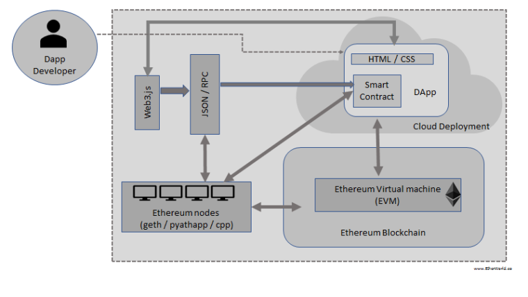

# Ethereum

[Ethereum](https://www.ethereum.org/) es una plataforma open-source que soporta  _smart contracts_ entre pares siguiendo el modelo de Blockchain.

A continuación vamos a contar las principales características de este proyecto.

## Descentralización en nodos de igual jerarquía

Los objetivos de Ethereum son descentralizar la web, eliminando intermediarios y organismos reguladores. Por lo tanto la arquitectura tiene un esquema _peer-to-peer_, donde cada nodo tiene la misma importancia que los demás en una red Ethereum (en lugar de tener un servidor como fuente central de información).

## Ethereum Virtual Machine (EVM)

Cada nodo tiene instalado un ambiente donde se procesan los smart contracts: la Ethereum Virtual Machine (EVM), que trabaja a nivel bytecodes. Esto implica que un Smart Contract puede estar escrito en [Solidity](https://solidity.readthedocs.io/en/v0.5.3/), [Serpent](https://github.com/ethereum/wiki/wiki/Serpent), [Viper](https://vyper.readthedocs.io/en/latest/), [Lisk](https://lisk.io/) o Chain, cualquiera de estos lenguajes se compila a un bytecode que la máquina virtual de Ethereum puede interpretar.

## Ether

El _ether_ es una criptomoneda (también llamado cripto-combustible) que sirve para el intercambio de mensajes dentro de la red Ethereum. Cada vez que queremos procesar un smart contract en la EVM, esto implica un costo computacional que debe pagar el cliente (el que origina ese mensaje), evaluado en una cierta cantidad de _ether_.

El valor del _ether_ varía como cualquier otra moneda, podemos ver [el valor actual en varios sitios web](https://coinmarketcap.com/es/currencies/ethereum/).

### Medidas de ether

Existen denominaciones para diferentes valores, que podemos ver en la siguiente tabla

| Denominación | Valor |
| ------- | ----- |
| wei | 1 |
| szabo | 10^12 |
| finney | 10^15 |
| ether | 10^18 |
| kether, einstein | 10^21 | 

Para más información recomendamos ver [esta tabla](https://etherconverter.online/)

## Circuito de flujo de un mensaje

https://github.com/ethereum/wiki/wiki/Ethereum-Development-Tutorial

Una vez que accedemos a una red privada de Ethereum, podemos enviar un mensaje, lo que implica procesar un smart contract con valores concretos. Estos mensajes se agrupan hasta formar un bloque, entonces 
* 

contar nodo Geth que tiene EVM => que corre Smart Contracts
* qué es el ether => lo que se necesita para correr un Smart Contract, porque el procesamiento sale guita
* concepto de gas en la red privada, cuenta

## Más información

* [este artículo](https://cryptodigestnews.com/blockchain-basics-what-is-evm-52d83616764)
