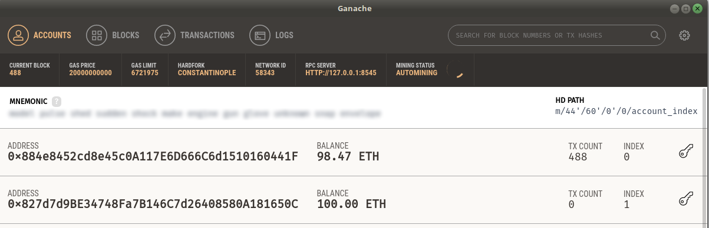

# Primer ejemplo de Smart Contract: una billetera virtual

Asumimos que previamente [instalaste el entorno Ethereum](startupEthereumLocal.md). Si no es así te recomendamos que lo hagas.

Nuestro primer ejemplo será muy sencillo, una billetera virtual (una extensión de un ejemplo anterior que quizás hayan visto, el monedero). La billetera registra de cada persona cuánta plata tiene, y admite dos operaciones:

* poner plata en la billetera
* sacar plata

por el momento dejamos afuera la posibilidad de hacer transacciones con otras personas.

A partir de aquí desarrollaremos

* Entorno de desarrollo
  * Lenguaje Solidity
  * IDE: Visual Studio + plugin
* Primer smart contract

## Entorno de desarrollo

### El lenguaje del Smart Contract

Utilizaremos el lenguaje **Solidity** que es el más estable en la comunidad, y que tiene muchas reminiscencias de javascript. Toda la documentación se accede a partir de [este link](https://solidity.readthedocs.io/).

### IDE

La propuesta oficial de Ethereum es trabajar con un IDE online llamado [Remix](https://remix.ethereum.org/#optimize=false), aunque hay que decir que es bastante limitado. Entonces nuestro consejo es que trabajes con

* [Visual Studio Code](https://code.visualstudio.com/)
* con el plugin [Solidity](https://github.com/juanfranblanco/vscode-solidity)

De hecho, [es la configuración que sugiere Truffle](https://truffleframework.com/tutorials/configuring-visual-studio-code).

## Inicialización de Truffle

[Truffle](https://truffleframework.com/docs/truffle/overview) es un entorno de desarrollo para la EVM (Ethereum Virtual Machine) que nos va a facilitar la compilación, prueba y despliegue de nuestros smart contracts. Para eso, vamos a crear un directorio truffle y ejecutaremos el script de inicialización:

```bash
mkdir truffle
cd truffle
truffle init
```

Esto nos genera una carpeta truffle con los siguientes subdirectorios:

* **build**: donde estarán los smart contracts "compilados" a JSON para las EVM
* **contracts**: donde iremos ubicando nuestros propios smart contracts
* **migrations**: crearemos scripts en javascript para deployar los smart contracts en las EVM de prueba
* **test**: los tests unitarios escritos en javascript nos permitirán validar nuestros smart contracts
* además, el archivo `truffle-config.js` contiene información importante, como a cuál EVM nos vamos a conectar para trabajar. Una vez que hayamos instalado ganache, la configuración que debemos seguir es la siguiente

```js
module.exports = {
  /**
   * Networks define how you connect to your ethereum client and let you set the
   * defaults web3 uses to send transactions. If you don't specify one truffle
   * will spin up a development blockchain for you on port 9545 when you
   * run `develop` or `test`. You can ask a truffle command to use a specific
   * network from the command line, e.g
   *
   * $ truffle test --network <network-name>
   */

  networks: {
    rpc: {
      host: "localhost",
      port: 8543
    },

    development: {
      host: "localhost", //our network is running on localhost
      port: 8545, // port where your blockchain is running
      network_id: "*",
      from: "0x884e8452cd8e45c0A117E6D666C6d1510160441F", // use the account-id generated during the setup process
      gas: 2000000
    },

    ...
```

Dejamos toda la configuración por defecto, pero debemos cambiar

* el puerto donde esté levantado Ganache (8545 en nuestro caso)
* la configuración **from** debe utilizar la primera cuenta que aparezca en la lista de cuentas de Ganache
* el gas puede ser necesario ajustarlo en base a la complejidad computacional del contrato

Si levantamos Ganache, veremos el puerto, el nombre de la red, el gas actual y la primera de las cuentas que coincide con el valor `from` de nuestra configuración de truffle:



## Ahora sí, nuestro primer smart contract

Veamos el código

```js
pragma solidity ^0.5.0;

/**
 * Smart contract que representa una billetera virtual
 */
contract Wallet {
    // mapa
    //   clave => una dirección de Ethereum que representa una persona física
    //   valor => $$$ que tiene
    // wallet es el nombre de la variable con visibilidad pública
    mapping (address => int256) public wallet;

    // validación general para poner o sacar
    modifier positive(int256 value) {
        require(value > 0, "Value must be positive");
        _;  // delegamos la ejecución a la función que la llamó
    }

    // poner plata en la billetera
    function put(address owner, int256 howMuch) public positive(howMuch) {
        int256 money = wallet[owner];  // por defecto es 0
        money = money + howMuch;
        wallet[owner] = money;
    }

    // sacar plata de la billetera
    function withdraw(address owner, int256 howMuch) public positive(howMuch) {
        int256 money = wallet[owner];  // por defecto es 0
        require(money >= howMuch, "Not enough cash");
        money = money - howMuch;
        wallet[owner] = money;
    }

}
```

Algunas observaciones:

* un smart contract tiene ciertas similitudes con una clase, tiene estructura interna y comportamiento definido a partir de funciones
* en nuestro caso, el dinero que tiene cada persona se almacena en un mapa que relaciona _address_ con un entero que admite negativos. Pueden ver [la lista de tipos que admite Solidity](https://solidity.readthedocs.io/en/latest/types.html). Fíjense que hay una gran cantidad de tipos de dato asociados a números: fixed, ufixed, int256, uint256, int8, int128, etc. y esto tiene que ver con a) el almacenamiento, b) el procesamiento ya que la Virtual Machine nos cobrará más por operaciones que involucren datos más voluminosos que otros.
* una consecuencia negativa de esto es que el lenguaje está pensado para optimizar el procesamiento: entonces cuando quiero sacar plata y no tengo suficiente efectivo, el mensaje de error es menos representativo de lo que nos gustaría: "No tiene suficiente efectivo". Para mostrar la cantidad de efectivo que tenemos, necesitamos concatenar ese valor con un mensaje de error, y a) solidity no tiene por el momento una operación de concatenación de strings, b) eso obedece a que es una operación costosa, que penaliza a quien envió el mensaje con más gas. Debemos entender esto en el contexto de una base descentralizada, que corre en cientos de miles de nodos con una capacidad de procesamiento acotada.
* cuando ponemos o sacamos plata, no queremos recibir un valor negativo para ese tipo de operaciones. Lo interesante es que Solidity provee un **modifier**, un decorador que se puede incorporar a una función y que ejecuta código antes o después de ella. Los guiones bajos (`_;`) en el modificador delegan la ejecución a la función que la llamó. Esto permite que escribamos primero alguna validación, o hagamos algo posteriormente.
* también es interesante la función `require` que es similar al `assert` de algunos frameworks, una forma declarativa de escribir una condición que queremos cumplir y un mensaje de error por el cual salir si esa condición no se satisface

## Migración

Esta parte es necesaria para poder correr las migraciones a los diferentes entornos presentes, así que vamos a crear un archivo `2_deploy_wallet.js`, donde lo único necesario es el prefijo que indica a truffle el orden en el cual encarar las migraciones (por un tema de dependencias, si un smart contract depende de otro es importante migrarlos en el orden adecuado).

El deploy se escribe de esta manera:

```js
var Wallet = artifacts.require("./Wallet.sol")

module.exports = function(deployer) {
   deployer.deploy(Wallet)
}
```

Y lo ejecutamos de la siguiente manera

```bash
truffle compile
truffle migrate
```

## Otros tutoriales

* [Getting started with ganache](https://www.codementor.io/swader/developing-for-ethereum-getting-started-with-ganache-l6abwh62j)
* [Ethereum Smart Contract Tutorial](https://rubygarage.org/yblog/ethereum-smart-contract-tutorial)
* [How to upgrade smart contracts](https://medium.com/bitclave/the-easy-way-to-upgrade-smart-contracts-ba30ba012784)

## Cómo sigo

Podés

* [Ver cómo se resuelve el testeo unitario de la billetera virtual](./walletTest.md)
* [Volver a la página central](../README.md)
