# Pruebas manuales de la billetera virtual

Ahora que nuestro smart contract pasó las validaciones, podemos intentar deployar en una red privada y hacer pruebas manuales.

Para ello, vamos a regenerar nuestra blockchain desde cero. En la terminal nos posicionamos en el directorio raíz de este proyecto y hacemos

```bash
rm -rf data   // borramos el directorio data donde estaba la blockchain
mkdir data    // creamos nuevamente el directorio
geth --datadir data init genesis.json  // inicializamos la blockchain
```

## Configurando la red live en Ganache

Detenemos el proceso geth iniciado manualmente con el comando `initEth.sh`. Luego desde Ganache GUI, Settings (la ruedita que está a la derecha) => cambiamos el puerto apuntado al 8543 (el que definimos como live)

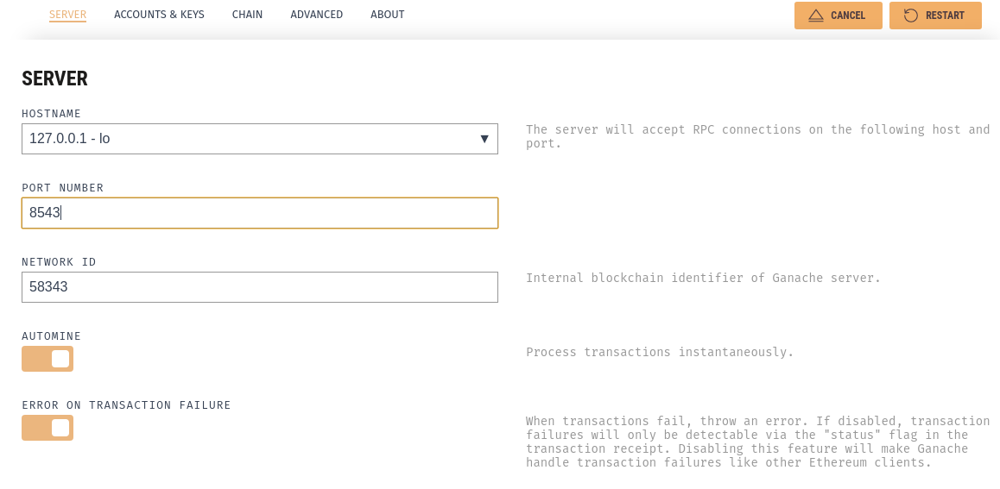

El cliente Ganache nos muestra que tenemos el bloque inicial creado mediante las especificaciones del archivo `genesis.json`:

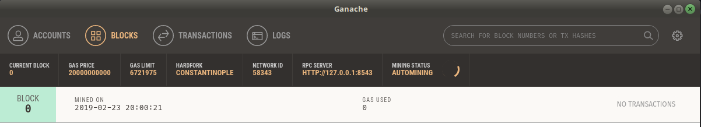

En la solapa Accounts buscamos la primera cuenta, y vamos a copiarla para configurar Truffle:

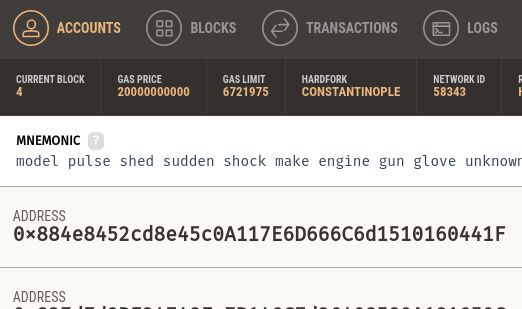

## Configuración adicional para Truffle

Truffle ya está configurado para levantar la instancia que Ganache automáticamente mina con cuentas de prueba, para no pisar esta definición vamos a configurar otra red, en el archivo `truffle-config.js`:

```js
module.exports = {
  networks: {
    rpc: {
      ...
    },

    development: {
      ...

    // nueva red
    live: {
      host: "localhost",
      port: 8543,             // Custom port
      network_id: 58343,      // Custom network
      gas: 6721975,           // Gas sent with each transaction (default: ~6700000)
      gasPrice: 20000000000,  // 20 gwei (in wei) (default: 100 gwei)
      from: '0x884e8452cd8e45c0A117E6D666C6d1510160441F',
        // La primera cuenta que apareció en Ganache
    },
```

A continuación vamos a deployar nuestro smart contract apuntando al nodo `live`:

```bash
cd truffle
truffle migrate --network live --reset
```

Después de la migración veremos que hay nuevos bloques en nuestra blockchain `live`:


También las transacciones que involucraron crear contractos y llamadas internas:

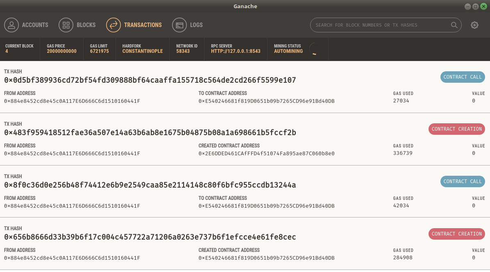

### Troubleshooting: gas excede el límite del bloque

Si te aparece este problema

```js
Error:  *** Deployment Failed ***

"Migrations" exceeded the block limit (with a gas value you set).
   * Block limit:  6721975
   * Gas sent:     8500000
   * Try:
      + Sending less gas.
      + Setting a higher network block limit if you are on a
        private network or test client (like ganache).

    at /home/fernando/.nvm/versions/node/v8.10.0/lib/node_modules/truffle/build/webpack:/packages/truffle-deployer/src/deployment.js:364:1
    at <anonymous>
    at process._tickCallback (internal/process/next_tick.js:188:7)
```

es que la cantidad de gas enviada supera la que el bloque puede aceptar, entonces debemos cambiar la configuración en `truffle-config.js`

```js
    live: {
      host: "localhost",
      port: 8543,
      network_id: 58343,
      gas: 6721975,   // <== ajustar al gas soportado por el bloque
```

## 1, 2, 3, probando

Iniciamos la consola truffle

```bash
truffle console --network live
```

Y podemos probar nuestra primera transacción

```js
> var walletInstance = await Wallet.deployed()
> walletInstance.put('0x827d7d9BE34748Fa7B146C7d26408580A181650C', 150)
```

Como resultado vemos el siguiente output

```js
{ tx: '0xb222ac9c6f1117956e7309365f778340a921fabd7f5b3c9550eed6137bfc8e84',
  receipt:
   { transactionHash: '0xb222ac9c6f1117956e7309365f778340a921fabd7f5b3c9550eed6137bfc8e84',
     transactionIndex: 0,
     blockHash: '0xe01cb6cad5106d209f702b2814c57bb6fc44b045b5d47189bd9b5990e6f6888e',
     blockNumber: 5,
     from: '0x884e8452cd8e45c0a117e6d666c6d1510160441f',
     to: '0x2e6dded461cafffd4f51074fa895ae87c060b8e0',
     gasUsed: 43623,
     cumulativeGasUsed: 43623,
     contractAddress: null,
     logs: [],
     status: true,
     logsBloom: '0x00000000000000000000000000000000000000000000000000000000000000000000000000000000000000000000000000000000000000000000000000000000000000000000000000000000000000000000000000000000000000000000000000000000000000000000000000000000000000000000000000000000000000000000000000000000000000000000000000000000000000000000000000000000000000000000000000000000000000000000000000000000000000000000000000000000000000000000000000000000000000000000000000000000000000000000000000000000000000000000000000000000000000000000000000000000',
     v: '0x1c',
     r: '0x36733eb9e01b64e1b4398f402e6000900199e0ca0030ae64b1a0b1e21686b676',
     s: '0x433ff60193a17b8d25976b0ab4deab4424e0ff733a3ec111c9ff33f3bd45e28c',
     rawLogs: [] },
  logs: [] }
```

En Ganache, vemos un nuevo bloque que se incorporó a la blockchain (el quinto)

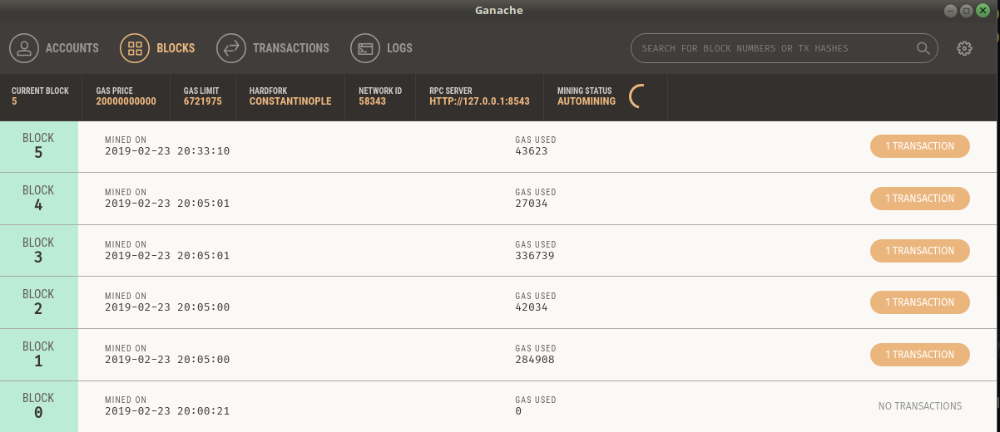

En la solapa transacción vemos la operación put reciente (podemos hacer click y nos lleva al detalle):

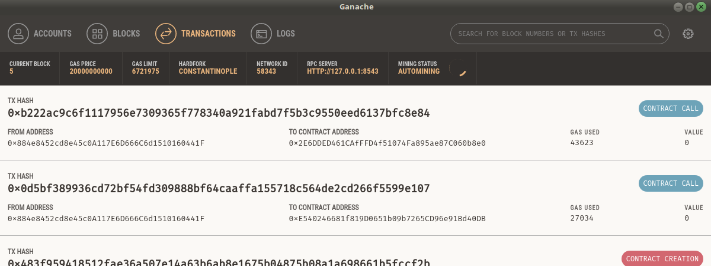

## Retirar plata

Ahora queremos retirar 25 pesos de esa cuenta:

```js
walletInstance.withdraw('0x827d7d9BE34748Fa7B146C7d26408580A181650C', 25)
```

Eso produce la creación de un sexto bloque:

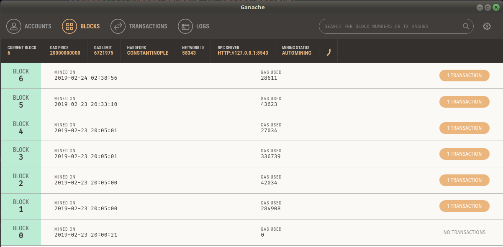

con su correspondiente transacción (que pueden ver en el mismo link del bloque o en la solapa transactions).

Podemos acceder al valor actual de la billetera para esa cuenta:

```js
walletInstance.wallet.call('0x827d7d9BE34748Fa7B146C7d26408580A181650C')
<BN: 7d>
```

`7d` en hexadecimal es 125 en decimal, es decir, el saldo de nuestra billetera tras poner 150 y retirar 25. Vemos que no se generó un bloque nuevo pero sí hubo una transacción asociada al bloque 6, por la operación de lectura

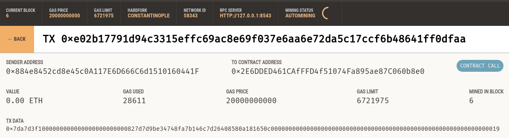

## Operaciones con error

Qué sucede si queremos retirar 250 pesos?

```js
walletInstance.withdraw('0x827d7d9BE34748Fa7B146C7d26408580A181650C', 250)
Error: Returned error: VM Exception while processing transaction: revert Not enough cash -- Reason given: Not enough cash.
```

junto con un buen stack trace, algo bueno si vamos a desarrollar una aplicación. Como resultado

* se generó un séptimo bloque (aunque al revertirse la operación no hubo cambios)
* y se agregó una transacción
* además en el log podemos ver el mensaje de error

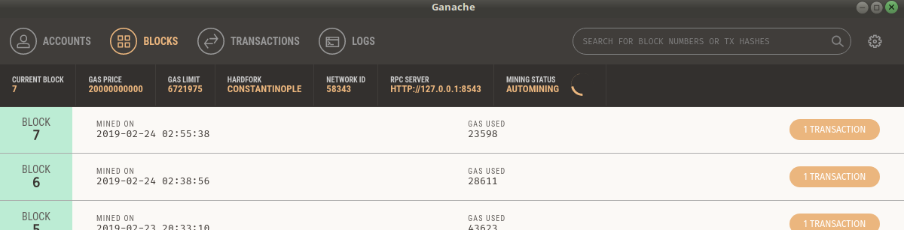

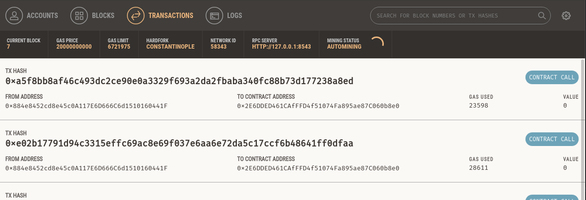

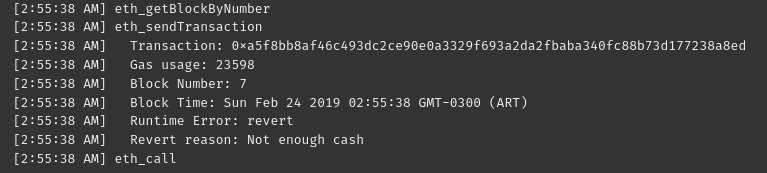

## Cómo sigo

Podés

* [Ver cómo integrar un frontend react con blockchain](./app.md)
* [Volver a la página central](../README.md)
